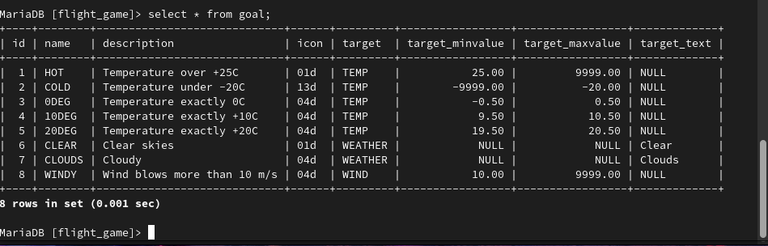
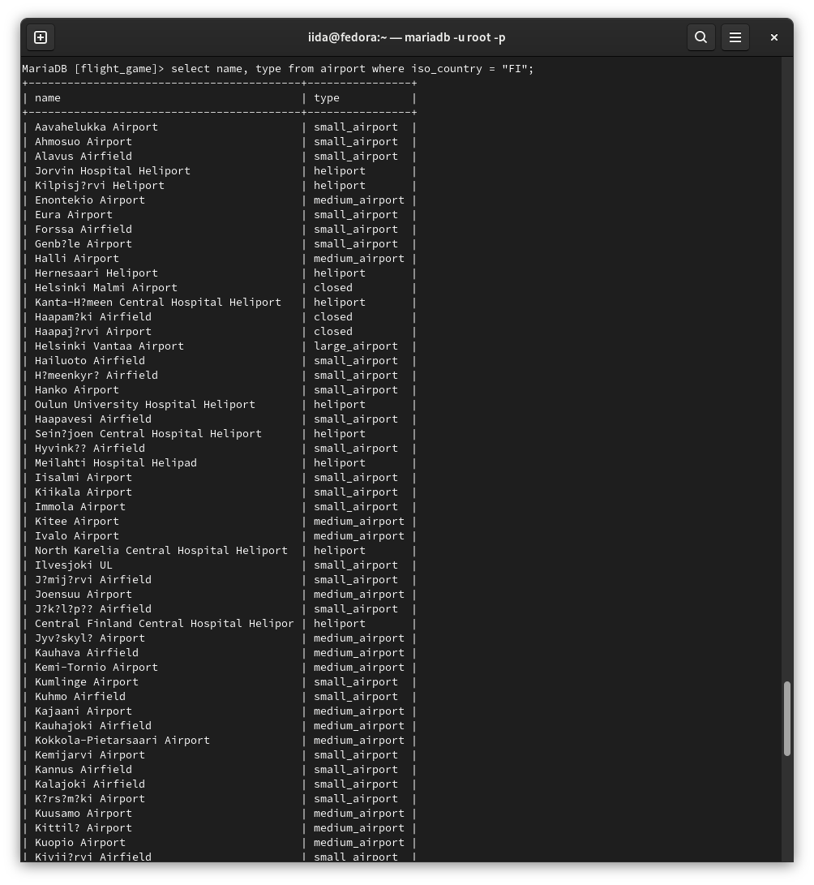
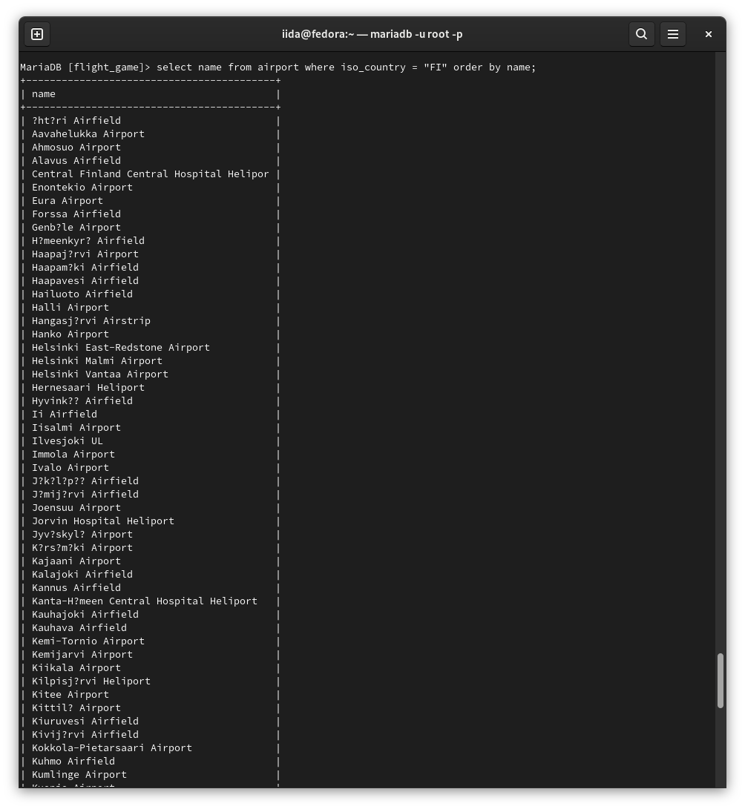
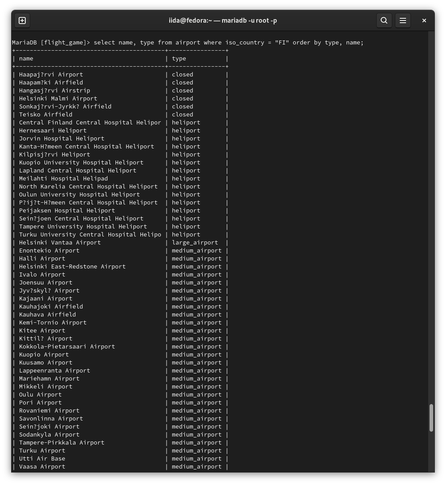
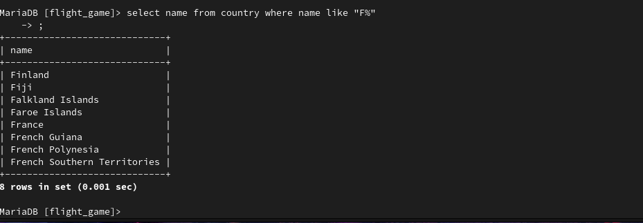
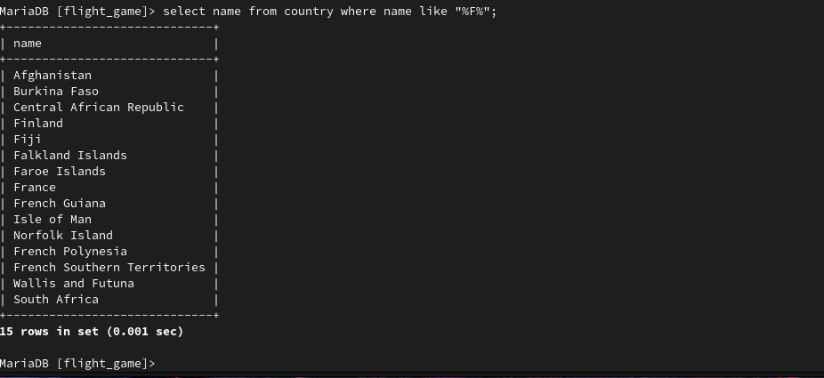
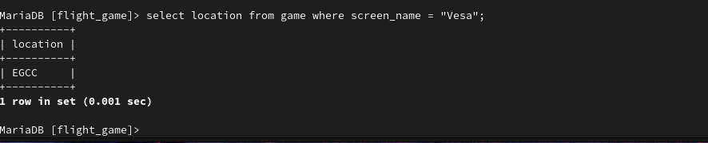
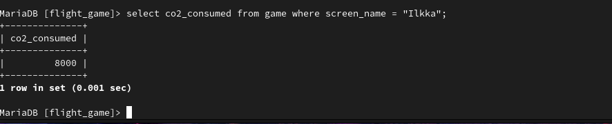
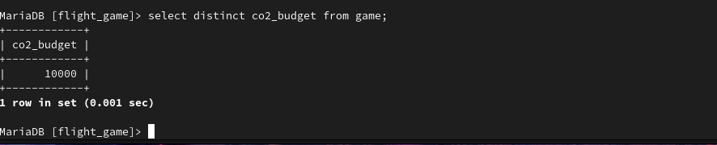
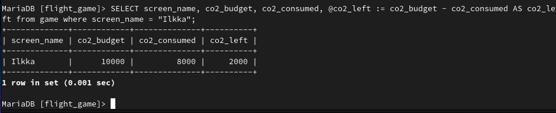

# Exercises 2: Single Table Queries

### Exercise 1

``select * from goal;``
### Exercise 2

``select name, type from airport where iso_country = "FI";``
### Exercise 3

``select name from airport where iso_country = "FI" order by name;``
### Exercise 4

``select name, type from airport where iso_country = "FI" order by type, name;``
### Exercise 5

``select name from country where name like "F%;"``
### Exercise 6

``select name from country where name like "%F%";``
### Exercise 7

``select location from game where screen_name = "Vesa";``
### Exercise 8

``select co2_consumed from game where screen_name = "Ilkka";``
### Exercise 9
``select distinct co2_budget from game;``

### Exercise 10

``SELECT screen_name, co2_budget, co2_consumed, @co2_left := co2_budget - co2_consumed AS co2_left from game where screen_name = "Ilkka";``