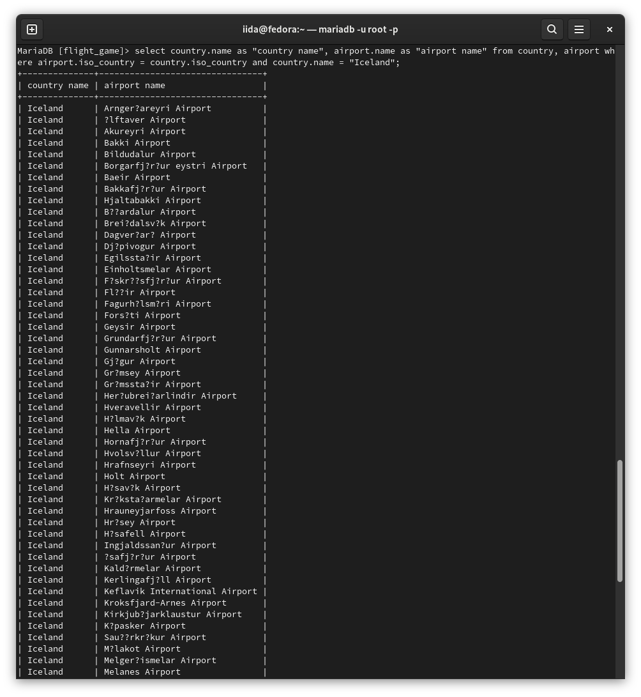
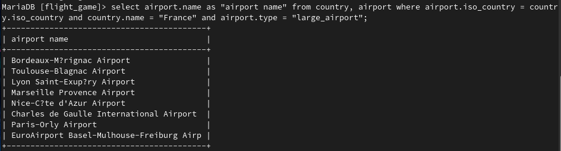
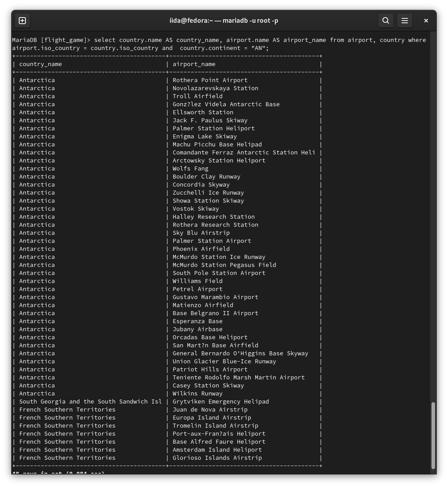
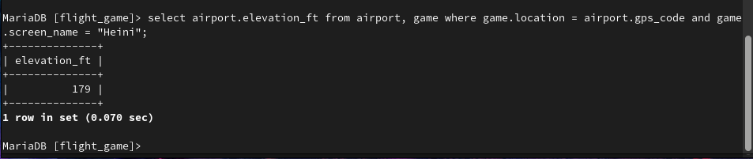
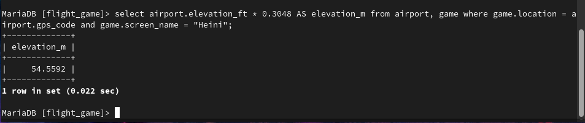
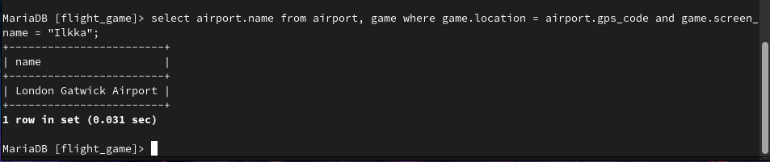
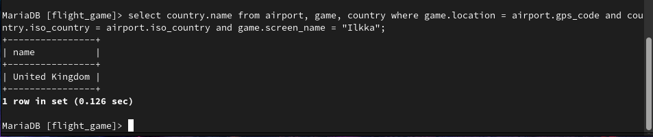
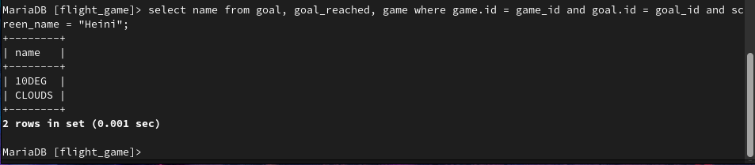
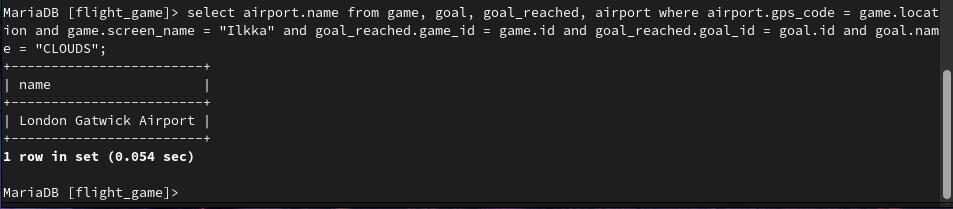
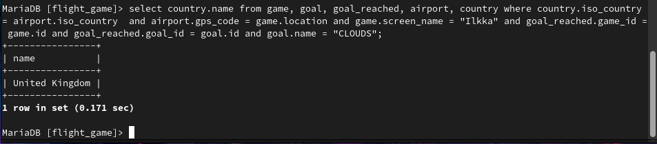

# Exercises 3: Multiple Table Queries
### Exercise 1

``select country.name as "country name", airport.name as "airport name" from country, airport where airport.iso_country = country.iso_country and country.name = "Iceland";``
### Exercise 2

``select airport.name as "airport name" from country, airport where airport.iso_country = country.iso_country and country.name = "France" and airport.type = "large_airport";``
### Exercise 3

``select country.name AS country_name, airport.name AS airport_name from airport, country where airport.iso_country = country.iso_country and  country.continent = "AN";``
### Exercise 4

``select airport.elevation_ft from airport, game where game.location = airport.gps_code and game.screen_name = "Heini";``
### Exercise 5

``select airport.elevation_ft * 0.3048 AS elevation_m from airport, game where game.location = airport.gps_code and game.screen_name = "Heini";``
### Exercise 6

``select airport.name from airport, game where game.location = airport.gps_code and game.screen_name = "Ilkka";``
### Exercise 7

``select country.name from airport, game, country where game.location = airport.gps_code and country.iso_country = airport.iso_country and game.screen_name = "Ilkka";``
### Exercise 8

``select name from goal, goal_reached, game where game.id = game_id and goal.id = goal_id and screen_name = "Heini";``
### Exercise 9
``select airport.name from game, goal, goal_reached, airport where airport.gps_code = game.location and game.screen_name = "Ilkka" and goal_reached.game_id = game.id and goal_reached.goal_id = goal.id and goal.name = "CLOUDS";``

### Exercise 10

``select country.name from game, goal, goal_reached, airport, country where country.iso_country = airport.iso_country  and airport.gps_code = game.location and game.screen_name = "Ilkka" and goal_reached.game_id = game.id and goal_reached.goal_id = goal.id and goal.name = "CLOUDS";``