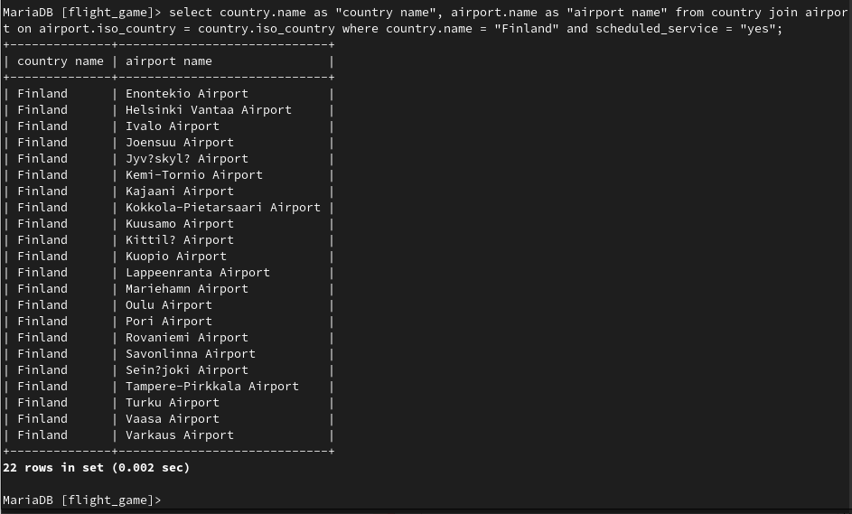
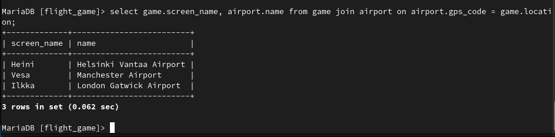
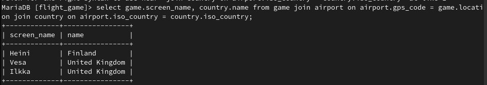
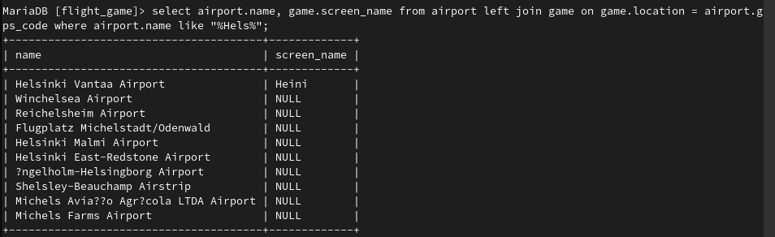
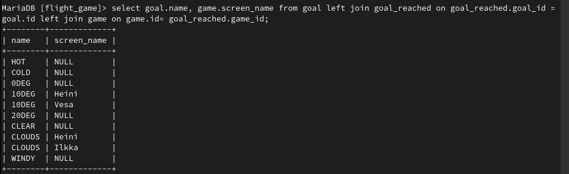

# Exercises 4: Join
### Exercise 1

``select country.name as "country name", airport.name as "airport name" from country join airport on airport.iso_country = country.iso_country where country.name = "Finland" and scheduled_service = "yes";``
### Exercise 2

``select game.screen_name, airport.name from game join airport on airport.gps_code = game.location;``
### Exercise 3

``select game.screen_name, country.name from game join airport on airport.gps_code = game.location join country on airport.iso_country = country.iso_country;``
### Exercise 4

``select airport.name, game.screen_name from airport left join game on game.location = airport.gps_code where airport.name like "%Hels%";``
### Exercise 5

``select goal.name, game.screen_name from goal left join goal_reached on goal_reached.goal_id =
goal.id left join game on game.id= goal_reached.game_id;``