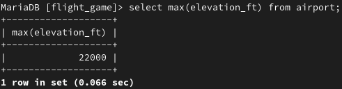
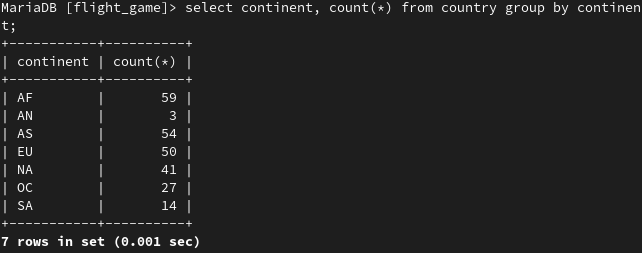
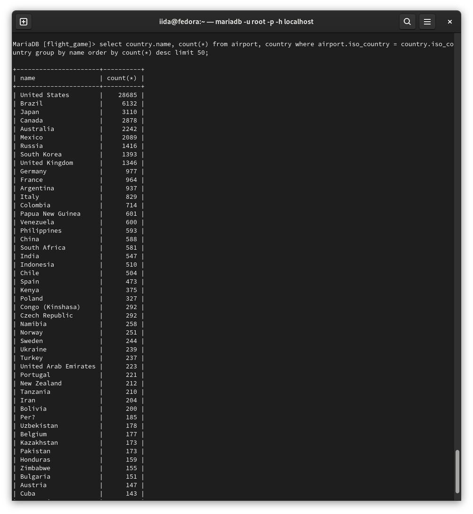
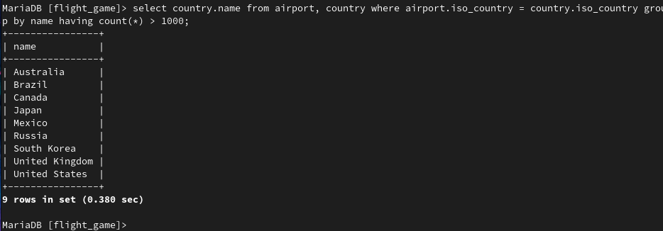
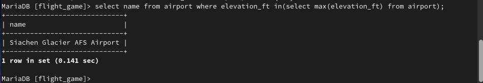
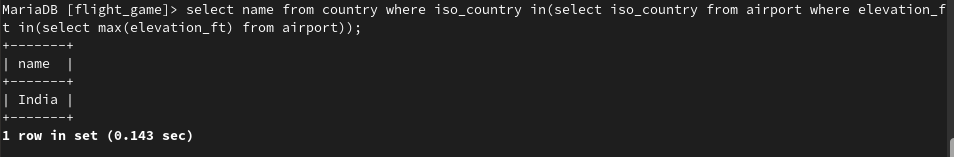
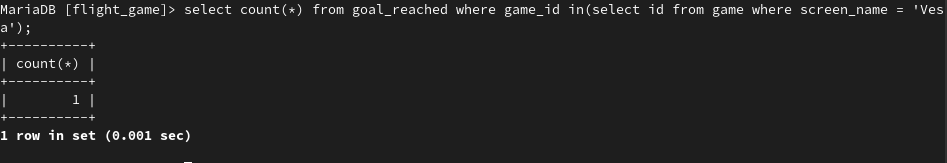
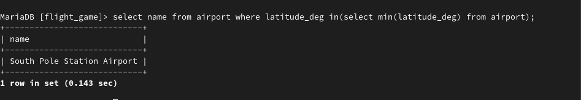

# Exercises 6: Aggregate Queries
### Exercise 1

``select max(elevation_ft) from airport;``
### Exercise 2

``select continent, count(*) from country group by continent;``
### Exercise 3

``select game.screen_name, count(*) from game join goal_reached on game.id = goal_reached.game_id group by game.screen_name;``
### Exercise 4

``select screen_name from game where co2_consumed in(select min(co2_consumed) from game);``
### Exercise 5

``select country.name, count(*) from airport, country where airport.iso_country = country.iso_country group by name order by count(*) desc limit 50;``
### Exercise 6

``select country.name from airport, country where airport.iso_country = country.iso_country group by name having count(*) > 1000;``
### Exercise 7

``select name from airport where elevation_ft in(select max(elevation_ft) from airport);``
### Exercise 8

``select name from country where iso_country in(select iso_country from airport where elevation_ft in(select max(elevation_ft) from airport));``
### Exercise 9

``select count(*) from goal_reached where game_id in(select id from game where screen_name = 'Vesa');``
### Exercise 10

``select name from airport where latitude_deg in(select min(latitude_deg) from airport);``