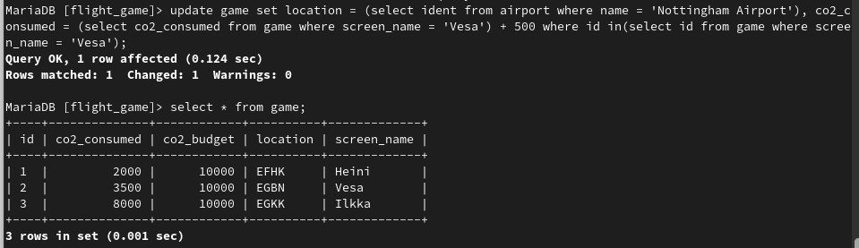
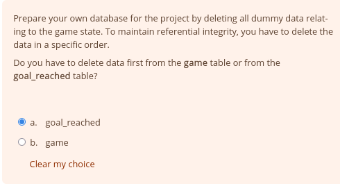
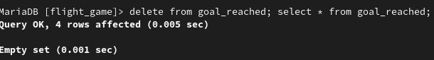

# Exercises 7: Update Queries
### Exercise 1

``update game set location = (select ident from airport where name = 'Nottingham Airport'), co2_consumed = (select co2_consumed from game where screen_name = 'Vesa') + 500 where id in(select id from game where screen_name = 'Vesa');``

### Exercise 2

### Exercise 3

``delete from goal_reached; select * from goal_reached;``
### Exercise 4

``delete from game; select * from game;``